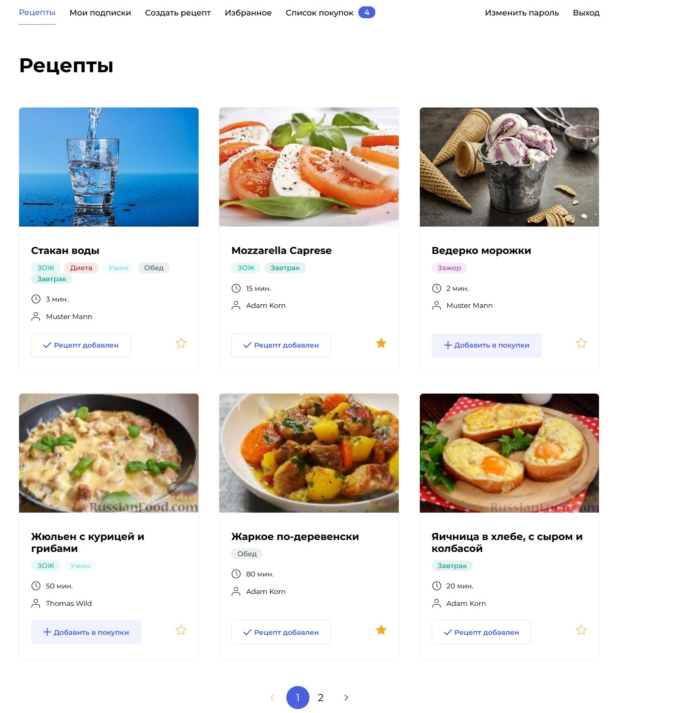

# "Foodgram project" 

# Public deployment: [http://romkas-foodgram.hopto.org/](http://romkas-foodgram.hopto.org/)


## Description

This is a web application where users can share their favourite recipes, subscribe to other users, automatically generate shopping lists from ingredients.



## Technology

* Programming language: Python 3.8.10
* Backend: Django 3.2.13 with Django REST framework 3.13.1
* Database: PostgreSQL
* Frontend: React
* Web server, reverse proxy: Nginx
* WSGI server: gunicorn


## How to run the project in dev-mode

- clone this repository to your local machine
```
git clone https://github.com/SokolovskiR/foodgram-project-react
```
- run once inside *infra* folder to build the frontend
```
docker-compose up -d
``` 
- create a virtual environment inside *backend* folder
```
python3 m -venv venv
``` 
- activate virtual environment
```
source venv/bin/activate
``` 
- install dependencies in requirements.txt
```
pip install -r requirements.txt
``` 
- inside the folder with manage.py file execute the following command for migrations:

```
python3 manage.py migrate
```
- inside the same folder execute this command to create a superuser:
```
python3 manage.py createsuperuser
```
- inside the same folder execute this command to start the development server:
```
python3 manage.py runserver
```

## API documentation

[http://romkas-foodgram.hopto.org/api/docs/](http://romkas-foodgram.hopto.org/api/docs/)


### Author
Roman Sokolovski
